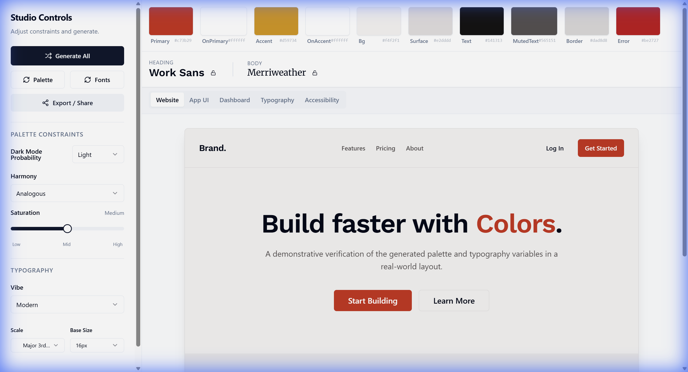
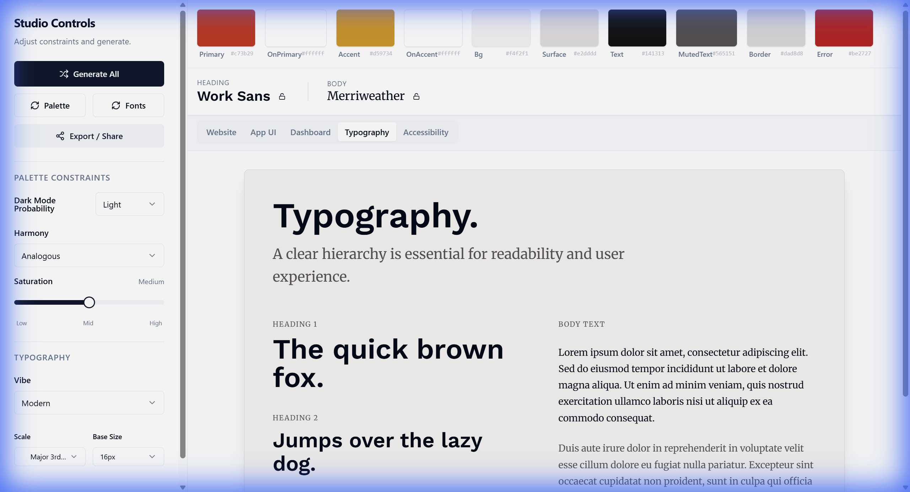
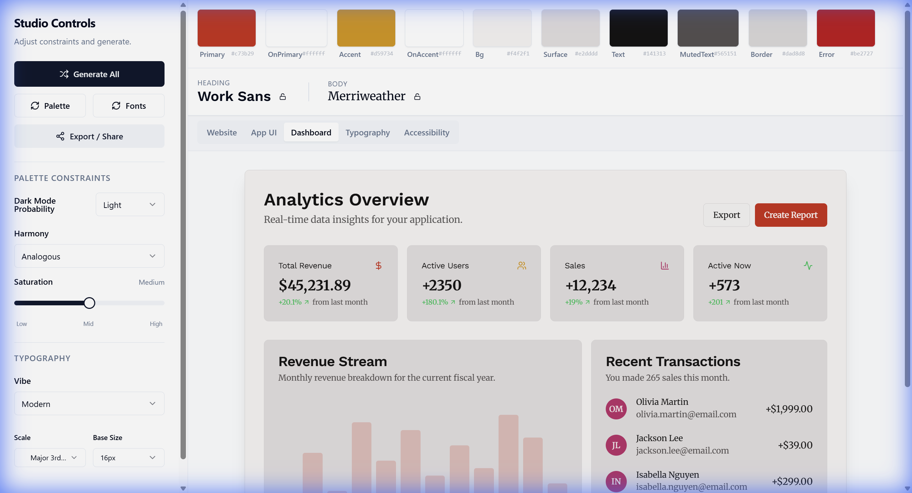
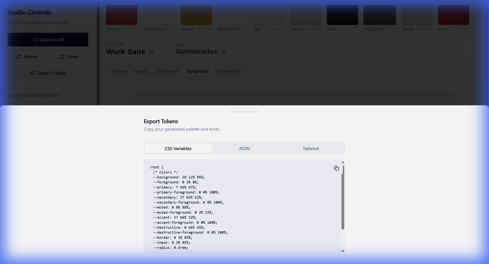

# Chromatype Studio v2.0



> **A deterministic, AI-powered design system generator for modern web applications.**
> Instantly generate accessible, harmonious color palettes and typographic scales that work in the real world.

[](https://mamdouhmhed-235.github.io/chromatype-studio/)
[](package.json)
[](LICENSE)

---

## 🚀 Overview

**Chromatype Studio** is not just a random color picker. It is a **constraint-based design engine** engineered to produce production-ready design tokens. It solves the "blank canvas" problem by using seeded algorithms to generate mathematically harmonious systems that adhere to WCAG accessibility standards.

**New in v2.0:**
*   **Deep Typography Engine**: Modular scales (Golden Ratio, Major Third) with micro-adjustments.
*   **Extended Harmonies**: Split-complementary, Tetradic, and Monochromatic generation.
*   **Dashboard Preview**: Stress-test your colors in a data-dense analytics interface.

---

## ✨ Key Features

### 🎨 Intelligent Palette Engine
*   **15+ Semantic Roles**: Automatically maps colors to UI roles (`bg`, `surface`, `primary`, `success`, `error`, etc.).
*   **Harmony Enforcement**: Locks colors to specific relationships (Analogous, Triadic, etc.) while preserving contrast.
*   **Smart Contrast**: Ensures text is always legible on its background (WCAG AA/AAA).

### ✍️ Typographic Systems
*   **Modular Scales**: Choose your ratio (e.g., `1.618` Golden Ratio) and base size.
*   **Font Pairing**: Curated "Vibe" tags pair compatible Google Fonts (e.g., "Tech", "Elegant", "Playful").
*   **Micro-Typography**: Adjust line-height and letter-spacing for headings and body independently.



### 📊 Real-World Previews
Don't design in a vacuum. verify your system in multiple contexts:
*   **Website**: Modern landing page layout.
*   **Dashboard**: **[NEW]** Data-heavy analytics UI with charts.
*   **App UI**: Clean SaaS application interface.



### 💾 Production Ready
*   **Export Tokens**: Get instant CSS Variables, Tailwind Config, or JSON.
*   **URL Sync**: Every state is serialized to the URL. Share your exact design system with a link.
*   **Mobile Optimized**: Fully responsive interface for designing on the go.



---

## 🛠️ Tech Stack

*   **Core**: React 18, TypeScript, Vite
*   **Styling**: Tailwind CSS, shadcn/ui
*   **State**: Zustand (with URL persistence)
*   **Icons**: Lucide React
*   **Charts**: Recharts (planned), CSS-only for lightweight previews.

---

## ⚡ Getting Started

### Prerequisites
*   Node.js 18+
*   npm or pnpm

### Installation

1.  **Clone the repository**
    ```bash
    git clone https://github.com/mamdouhmhed-235/chromatype-studio.git
    cd chromatype-studio
    ```

2.  **Install dependencies**
    ```bash
    npm install
    ```

3.  **Run development server**
    ```bash
    npm run dev
    ```

4.  **Build for production**
    ```bash
    npm run build
    ```

---

## 🤝 Contributing

Contributions are welcome! Please feel free to submit a Pull Request.

1.  Fork the project
2.  Create your feature branch (`git checkout -b feature/AmazingFeature`)
3.  Commit your changes (`git commit -m 'Add some AmazingFeature'`)
4.  Push to the branch (`git push origin feature/AmazingFeature`)
5.  Open a Pull Request

---

## 📝 License

Distributed under the MIT License. See `LICENSE` for more information.
